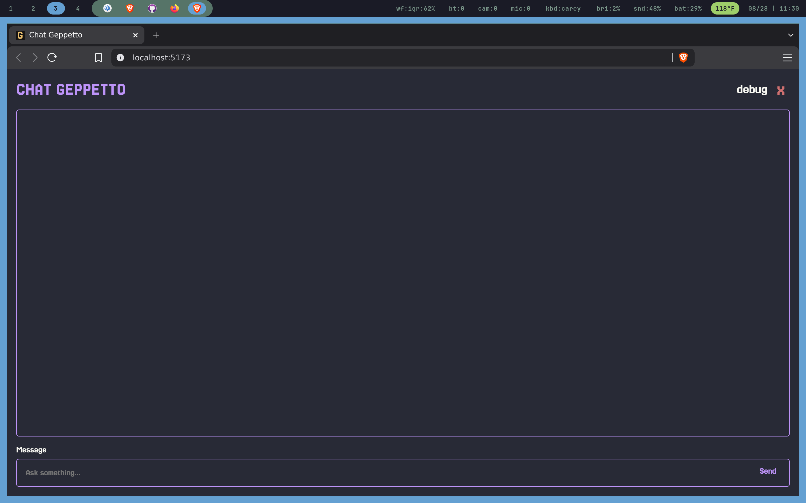
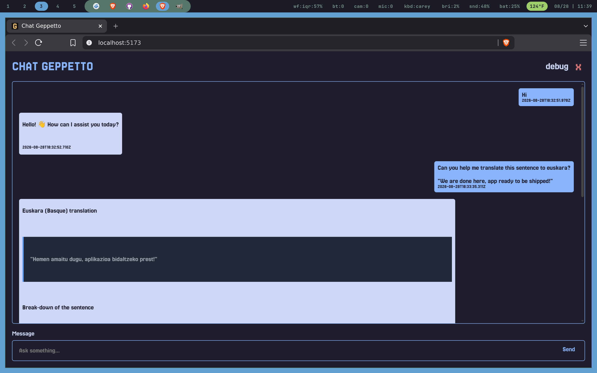

[](https://github.com/ch-geppetto/geppetto/actions/workflows/sync-data.yml)

# Technical Assessment

## ------ Notes

### Challenge Objective

Create a functional application where a user can interact with an AI model. Your submission should include:

- User Interface: A clean, intuitive text input field and a submit button.
- API Integration: Successfully fetch data from a generative AI API (e.g., OpenAI, Hugging Face, or Anthropic).
- Dynamic Rendering: Display the AI’s response clearly within the UI without a page reload.
- State Management: Implementation of loading states (spinners or skeletons) and robust error handling (e.g., handling API timeouts or empty prompts).
- Best Practices: Component-based architecture, semantic HTML, and responsive CSS.

### Bonus Challenge

To further demonstrate your seniority or attention to detail, consider adding:

- Persistent Chat History: Save and display a list of past prompts and responses (using LocalStorage or state) so they remain visible during the session.
- Session Management: A "Clear Chat" or "Reset" button to wipe the current history.
- Markdown Support: Render the AI response using Markdown (to support code snippets or formatted text).
- Unit Testing: Include a few basic tests for your primary components or utility functions.

### Submission Checklist

- Prepare your response: Organize your thoughts clearly using a professional document editor or specialized tool.
- Explain Your Process: Provide the "how" and "why" behind your work through a written breakdown of your logic or a short video walkthrough.
- Provide Solution Link: GitHub repository, GitHub Repo / Link to file or cloud document.

## ------ Tasks

- [x] Build Spinner
- [x] Build TextBubble
- [x] Build Alert
- [x] Connect hugging-face API
- [x] Add cleaning mechanism
- [x] Add themes
- [x] Add store to manage the UI state
- [x] Add local storage to preserve chat
- [x] Missing date from messages
- [x] `Enter` submit, but `Enter + Shift` wont
- [x] Prevent sending a message if the state is loading
- [x] Add markdown parser
- [x] Debugger show only when needed
- [x] Add unit tests
- [x] Add workflows so it runs the tests
- [x] Add screenshots

## ------ Screenshots




## ------ Install

Running the app

```sh
npm run dev
```

Running the unit tests

```sh
npm run test
```
